<div align="center" class="cover">
<h1>DriveHub</h1>
<h2>Analisi, progettazione e realizzazione di un sistema informativo per concessionario</h2>
<p><strong>Corso di Ingegneria del Software</strong><br>
<strong>Anno Accademico 2025/2026</strong></p>
<p>Docente: <strong>Prof. Enrico Vicario</strong></p>
<p>Autore/i: <strong>[DA INSERIRE]</strong><br>
Matricola/e: <strong>[DA INSERIRE]</strong></p>
<p>Versione <strong>1.0 RC — 11 settembre 2026</strong><br>
Commit base: <code>ed03c32289aa663dfc04b1bf0c8fda15da326b47</code><br>
Fingerprint baseline verificata: <code>e7fb29af…aeec25</code></p>
</div>

## Indice ragionato

1. Statement applicativo e metodo
2. Fonti, scope e vocabolario
3. Requisiti e regole di business
4. Casi d'uso e tracciabilità
5. Interfaccia e navigazione
6. Architettura e responsabilità
7. Progettazione del dominio e dei workflow
8. Persistenza PostgreSQL
9. Scenari dinamici e transazioni
10. Implementazione e pattern
11. Strategia ed esiti dei test
12. Uso dell'intelligenza artificiale
13. Assunzioni, limiti e decisioni aperte
14. Conclusioni e guida alla discussione

## 1. Statement applicativo e metodo

DriveHub è un'applicazione desktop che coordina le attività essenziali di un
concessionario: catalogo, test drive, noleggio, vendita al cliente, acquisizione
di veicoli proposti dal cliente, inventario, ordini, prezzi, promozioni e
indicatori direzionali. Il problema progettuale non è una semplice anagrafica:
più attori operano sugli stessi veicoli e gli esiti economici devono restare
coerenti anche in presenza di errori o richieste concorrenti.

L'obiettivo è offrire a Customer, Salesman e Manager percorsi distinti,
proteggendo nel dominio e nel database le regole che non possono dipendere dal
solo stato dei pulsanti. La baseline usa Java 21, JavaFX 21, Maven, JDBC e
PostgreSQL 16. Il gateway di pagamento è intenzionalmente simulato e non tratta
dati finanziari reali.

Il lavoro è stato condotto in quattro cicli verificabili:

1. inventario in sola lettura delle fonti e registrazione dei conflitti;
2. specifica di requisiti, casi d'uso, pagine e modello dati;
3. implementazione a strati, con transazioni e concorrenza come rischi guida;
4. verifica su JDK 21, PostgreSQL 16 reale, JavaFX reale sotto Xvfb, UML e PDF.

La relazione descrive il prodotto effettivamente verificato. I soli campi
segnaposto ammessi sono nomi e matricole degli autori; le decisioni di dominio
non determinate dalle fonti sono indicate esplicitamente nel capitolo 13.

## 2. Fonti, scope e vocabolario

### 2.1 Gerarchia e uso delle fonti

In caso di contrasto si è adottato l'ordine: materiale ufficiale del corso;
diagrammi originali DriveHub; implementazione e documentazione DriveHub;
ChargeNet come benchmark di struttura; best practice compatibili. I file
originali in `Diagrammi/`, il materiale didattico e `ChargeNet-master/` sono
rimasti inalterati.

| Fonte | Contributo | Trattamento |
|---|---|---|
| note di project work e dispense UML/testing | forma della relazione, template UC, qualità dei diagrammi e categorie di test | regola metodologica |
| `Users SWE.drawio` | attori, obiettivi e include del pagamento | specifica da normalizzare |
| page-navigation e mockup | pagine e contenuti per ruolo | riferimento UI, non requisito esaustivo |
| `SWE ER.drawio` | concetti persistenti e domande aperte | ricostruzione con vincoli espliciti |
| package diagram originale | separazione presentation/business/domain/DAO | vincolo architetturale |
| ChargeNet | profondità documentale e organizzazione | nessuna regola del dominio copiata |

Il file originale chiamato `Login UI.png` rappresenta in realtà la
registrazione; `Employee UI.png` rappresenta il Manager. Queste incongruenze
sono risolte in base al contenuto, senza rinominare gli originali.

### 2.2 Scope

Sono inclusi autenticazione, catalogo, test drive, noleggi, riserva/acquisto,
proposta di un veicolo al concessionario, pagamenti dimostrativi, inventario,
ordini di stock, prezzi/promozioni e dashboard. Sono esclusi sedi multiple,
fornitori, officina, garanzie, danni, assicurazione, finanziamenti, fatturazione,
firma digitale, notifiche reali e pagamento/rimborso reale: le fonti non
forniscono requisiti sufficienti per modellarli correttamente.

### 2.3 Attori e concetti

- il **Customer** consulta e prenota, paga, compra/noleggia e propone un proprio
  veicolo;
- il **Salesman** prende in carico test drive e noleggi, gestisce lo stato
  operativo e formula offerte di acquisizione;
- il **Manager** legge indicatori, ordina stock, gestisce prezzi e decide sulle
  offerte;
- `User` è l'identità comune con un `Role`, non un quarto attore operativo.

`Vehicle` è la risorsa condivisa. Il suo `purpose` distingue `RENTAL`,
`FOR_SALE` e `ACQUISITION_REQUEST`; lo stato ne rappresenta la disponibilità.
`Rental` e `TestDrive` modellano processi temporali, `SaleOrder` e `Payment`
quelli economici, `PurchaseProposal` l'acquisizione dal Customer e
`StockOrder` l'approvvigionamento.

<div class="figure">
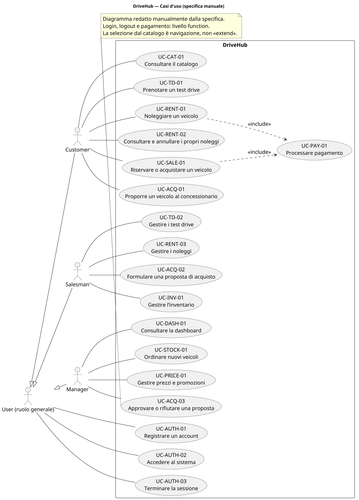
<p class="caption">Figura 1 — Confine DriveHub, attori esterni e obiettivi utente. Il pagamento è un caso incluso, non un attore.</p>
</div>

### 2.4 Tecnologie e strumenti

| Scelta | Motivazione nel progetto |
|---|---|
| Java 21 | target LTS tipizzato, coerente con il corso e verificato anche in container ufficiale |
| JavaFX 21 + FXML/CSS | desktop multipagina con separazione fra struttura della vista, stile e controller |
| Maven | build, dipendenze, profili, esecuzione test, JaCoCo e package riproducibili |
| JDBC + PostgreSQL 16 | controllo esplicito di transazioni, constraint, lock, CAS e query proprie del DB target |
| JUnit 5 + Mockito | test parametrizzati e isolati con porte/gateway controllabili; Mockito è caricato come javaagent |
| JaCoCo 0.8.14 | misura riproducibile della copertura senza trasformarla in prova di correttezza |
| Draw.io + PlantUML | originali visuali preservati e nuovi diagrammi progettuali versionabili, redatti manualmente |
| Docker Compose | database effimero e ripetibile, distinto dal volume applicativo locale |
| AI assistiva | audit e redazione con review su sorgenti, log, rendering e risultati; responsabilità agli autori |

## 3. Requisiti e regole di business

### 3.1 Requisiti funzionali

| Area | ID e obbligo |
|---|---|
| Accesso | RF-AUTH-01 registrazione univoca; RF-AUTH-02 login e routing; RF-AUTH-03 logout |
| Customer | RF-CAT-01 catalogo; RF-TD-01 prenotazione test drive; RF-RENT-01/02 noleggio, consultazione e annullamento; RF-SALE-01 riserva/acquisto; RF-ACQ-01 proposta veicolo |
| Salesman | RF-TD-02 gestione test drive; RF-RENT-03 noleggi assegnati; RF-ACQ-02 offerta; RF-INV-01 inventario |
| Manager | RF-DASH-01 indicatori; RF-STOCK-01 ordini; RF-PRICE-01 prezzi/promozioni; RF-ACQ-03 decisione proposta |
| Trasversali | RF-PAY-01 pagamento dimostrativo; RF-ERR-01 messaggi comprensibili e non sensibili |

I requisiti non funzionali rendono verificabile la qualità: password protette e
configurazione da ambiente (RNF-SEC-01), autorizzazione nel business
(RNF-SEC-02), invarianti Java/SQL (RNF-DATA-01), atomicità
(RNF-DATA-02), gestione della concorrenza (RNF-DATA-03), dipendenze a strati
(RNF-QUAL-01), porte sostituibili (RNF-QUAL-02), esiti UI distinti
(RNF-UX-01), ambiente Java 21/PostgreSQL 16 (RNF-PORT-01), dati fittizi
(RNF-PRIV-01) e tracciabilità degli ID (RNF-DOC-01).

### 3.2 Regole che guidano il design

| Gruppo | Regole principali e conseguenza |
|---|---|
| Identità | email, CF, targa e codice modello unici; ruoli limitati a Customer/Salesman/Manager |
| Catalogo | ogni Vehicle ha un modello e un purpose; prezzo o tariffa sono coerenti col purpose; valori non negativi |
| Tempo | `start < end`; overlap incompatibili rifiutati; intervalli adiacenti ammessi |
| Ownership | il Customer vede/modifica i propri oggetti; il Salesman modifica ciò che ha preso in carico |
| Pagamento | riferimento XOR Rental/SaleOrder; purpose compatibile; importo positivo ed esattamente dovuto; singolo esito terminale |
| Promozione | massimo un record sostituibile per veicolo; percentuale in `(0,100)`; nessun cumulo |
| Decisione | solo una proposta `OFFERED` è decidibile; Manager e istante sono registrati insieme |
| Concorrenza | vendita, saldo, slot, claim e decisione devono avere un solo vincitore quando competono |

La doppia protezione dominio/database è intenzionale: il dominio fornisce
errori significativi, mentre i constraint impediscono che altri percorsi JDBC
creino stati impossibili.

## 4. Casi d'uso e tracciabilità

Sono definiti diciotto template completi. Di seguito sono sviluppati i quattro
workflow più rischiosi; per ciascuno le alternative indicano il passo di
origine. Gli altri casi sono riassunti nella tabella finale e sono tracciati
fino ai test.

### 4.1 UC-RENT-01 — Noleggiare e pagare un veicolo

| Campo | Specifica |
|---|---|
| Livello | user goal |
| Attore primario | Customer |
| Supporto | gateway di pagamento simulato |
| Trigger | il Customer seleziona un veicolo `RENTAL` |
| Precondizioni | sessione Customer attiva; veicolo esistente e disponibile |
| Garanzia minima | nessun noleggio è presentato come pagato senza Payment `COMPLETED` |
| Garanzia di successo | Rental `REQUESTED` e Payment `COMPLETED` sono commit-tati insieme |
| Pagine | P-10 Catalogo, P-12 Noleggia, P-40 Pagamento, P-13 Prenotazioni |

Flusso base:

1. Il Customer seleziona un veicolo a noleggio dal catalogo.
2. Il sistema apre P-12.
3. Il Customer indica inizio e fine.
4. Il sistema valida periodo e sovrapposizioni.
5. Il sistema calcola e mostra il preventivo autorevole.
6. Il Customer conferma in P-40.
7. `CheckoutService` crea Rental e Payment nella stessa `UnitOfWork`.
8. Il gateway simulato approva e il Payment diventa `COMPLETED`.
9. Il commit conserva Rental `REQUESTED`; P-13 mostra la pratica.

Alternative: 3a date mancanti/invertite, nessuna scrittura; 4a overlap,
conflitto correggibile; 6a dialog annullato, nessun comando business; 7a
preventivo cambiato, gateway non invocato; 8a rifiuto previsto, Payment
`FAILED` e Rental `CANCELLED` sono commit-tati insieme; 8b eccezione inattesa,
rollback di tutte le scritture.

Evidenze: `CheckoutFunctionalTest#ftRent01AcceptedCheckout`,
`#ftRent02Periods`, `#ftRent03DeclinedCheckout`, smoke reali del dialog e test
PostgreSQL di rollback/concorrenza.

### 4.2 UC-SALE-01 — Riservare o acquistare un veicolo

| Campo | Specifica |
|---|---|
| Livello | user goal |
| Attore primario | Customer |
| Precondizioni | veicolo `FOR_SALE` disponibile; sessione Customer |
| Garanzia minima | nessuna doppia vendita o eccedenza sul residuo |
| Successo riserva | ordine `DEPOSIT_PAID`, veicolo `RESERVED`, Payment `SALE_DEPOSIT` |
| Successo acquisto | ordine `PAID`, veicolo `RESERVED`, Payment `SALE_BALANCE` |
| Pagine | P-10 e P-40 |

Flusso base:

1. Il Customer seleziona un veicolo in vendita.
2. Il servizio calcola prezzo e promozione applicabile.
3. Il Customer sceglie acconto o acquisto integrale e conferma l'importo.
4. Il servizio blocca il veicolo e ricontrolla disponibilità/preventivo.
5. Crea SaleOrder `RESERVED` e Payment nella stessa transazione.
6. Il gateway approva.
7. Un acconto esatto porta a `DEPOSIT_PAID`; un pagamento integrale esatto a
   `PAID`. Il veicolo non è più acquistabile da altri.

Alternative: 3a annullamento senza mutazioni; 4a preventivo scaduto o veicolo
già impegnato, nessun addebito; 5a acconto/saldo non esatto, rifiuto; 6a decline,
ordine `CANCELLED` e veicolo rilasciato atomicamente; 6b errore inatteso,
rollback; 7a saldo già coperto, secondo pagamento rifiutato.

Evidenze: `CheckoutFunctionalTest#ftSale01DepositBalanceDelivery`,
`#ftSale03DeclinedDeposit`, `#ftSale03FullPurchaseOnce`, smoke vendita e
`PostgresConcurrencyTest#doubleSale/#doubleBalance`.

### 4.3 UC-ACQ-03 — Approvare o rifiutare una proposta

| Campo | Specifica |
|---|---|
| Livello | user goal |
| Attore primario | Manager |
| Precondizioni | sessione Manager; proposta `OFFERED` |
| Garanzia minima | una decisione concorrente non sovrascrive la prima |
| Successo | stato terminale, Manager, motivazione e `decided_at` persistiti insieme |
| Pagina | P-33 Approvazioni |

Flusso base: (1) il sistema mostra le offerte in attesa; (2) il Manager ne
seleziona una; (3) sceglie “Approva”; (4) il servizio verifica ruolo e stato;
(5) un update compare-and-set da `OFFERED` registra `APPROVED`, revisore e
istante; (6) la coda viene aggiornata. Alternative: 1a coda vuota; 2a nessuna
selezione; 3a “Rifiuta” conduce a `REJECTED`; 4a un'altra sessione ha già
deciso, zero righe aggiornate e conflitto senza overwrite.

Evidenze: `UserGoalsFunctionalTest#ftAcq03OfferAndBothDecisions`,
`PurchaseProposalServiceTest#managerDecisionIsAtomic`, test PostgreSQL di
round-trip dell'istante e race CAS.

### 4.4 UC-PAY-01 — Processare un pagamento dimostrativo

| Campo | Specifica |
|---|---|
| Livello | subfunction inclusa da UC-RENT-01 e UC-SALE-01 |
| Attore primario | Customer |
| Supporto | `PaymentGateway` simulato |
| Precondizioni | riferimento e importo autorevole prodotti dal servizio |
| Garanzia minima | annullamento non scrive; failure non promuove l'operazione |
| Successo | Payment `COMPLETED` e stato dell'aggregato coerente nello stesso commit |
| Pagina | P-40 `PaymentDialog.fxml` |

Flusso base: (1) il dialog mostra importo e riferimento non sensibile; (2) il
Customer sceglie un metodo simulato; (3) conferma; (4) il servizio blocca il
riferimento, verifica ownership e residuo e salva Payment `PENDING`; (5) il
gateway approva; (6) Payment diventa `COMPLETED` e l'aggregato viene aggiornato.
Alternative: 2a nessun metodo; 3a annullamento; 4a non proprietario, stato non
ammesso, importo errato o residuo zero; 5a rifiuto con Payment `FAILED`; 5b
eccezione inattesa con rollback. Il gateway locale è privo di effetti esterni:
con un provider reale servirebbero idempotenza e riconciliazione.

### 4.5 Catalogo degli altri casi d'uso

| Attore | UC | Pagine | Evidenza principale |
|---|---|---|---|
| User | UC-AUTH-01/02/03 | P-02/P-01/workspace/P-00 | auth funzionale, sessione e routing JavaFX |
| Customer | UC-CAT-01, UC-TD-01, UC-RENT-02, UC-ACQ-01 | P-10/P-11/P-13/P-14 | filtri, overlap, ownership e rollback proposta |
| Salesman | UC-TD-02, UC-RENT-03, UC-ACQ-02, UC-INV-01 | P-20…P-23 | lifecycle, claim CAS, offerta e Observer after-commit |
| Manager | UC-DASH-01, UC-STOCK-01, UC-PRICE-01 | P-30…P-32 | aggregati noti, ordine atomico, pricing/promozione |

La matrice di progetto collega ogni riga a controller, servizio, dominio, porta
DAO, tabella e metodo JUnit. Tutte le righe risultano `V` nella baseline; le
policy A-05/A-08 restano da validare come decisioni, non come difetti tecnici.

## 5. Interfaccia e navigazione

La presentazione è composta da viste FXML e controller sottili. Welcome porta a
Login o Register; autenticazione e registrazione instradano al workspace del
ruolo; logout cancella la sessione e rende inaccessibili le route protette. I
workspace concentrano le attività correlate in tab, preservando la selezione e
mostrando messaggi locali quando l'input è correggibile.

<div class="figure">
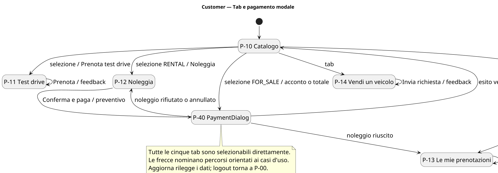
<p class="caption">Figura 2 — Percorso Customer: il dialog P-40 distingue conferma, rifiuto e annullamento.</p>
</div>

<div class="figure">
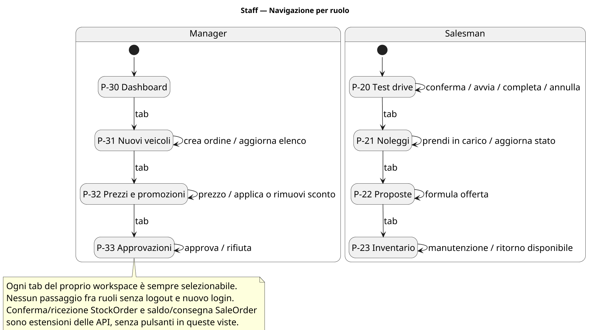
<p class="caption">Figura 3 — Workspace Salesman e Manager e ritorno comune alla welcome page.</p>
</div>

`CustomerWorkspaceController` ottiene il preventivo dal gateway UI e apre
realmente `PaymentDialog.fxml` sia per il noleggio sia per la vendita. Il
`ChoiceDialog` residuo sceglie soltanto fra acconto e acquisto integrale: non
sostituisce il dialog di pagamento. Durante un dialog il comando è protetto da
re-entrancy; la chiusura non può diventare un successo implicito.

<div class="figure">
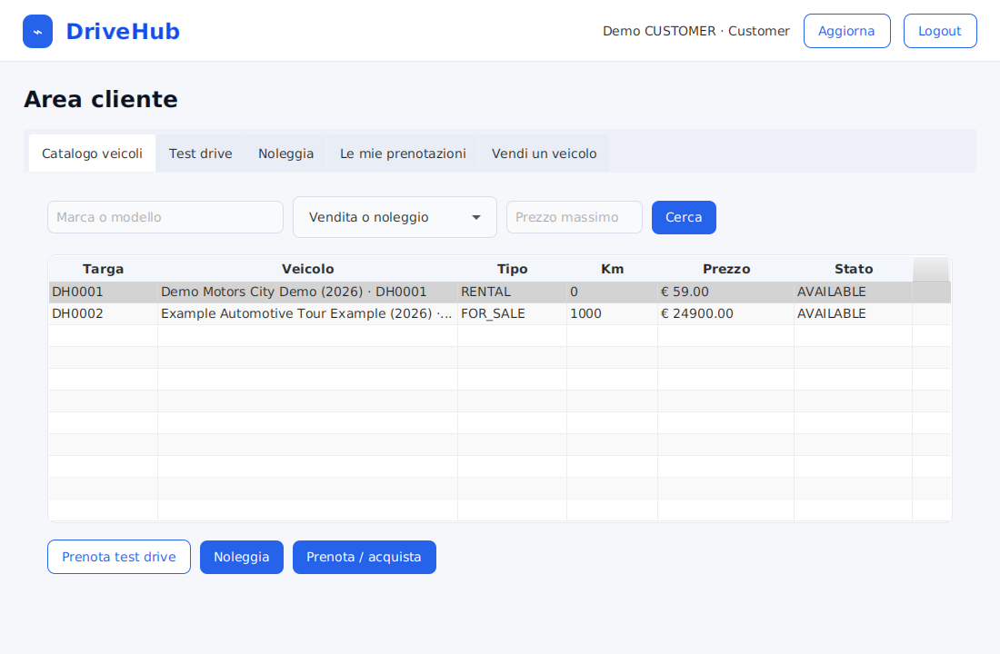
<p class="caption">Figura 4 — Catalogo Customer caricato dal composition root reale su PostgreSQL.</p>
</div>

<div class="figure">
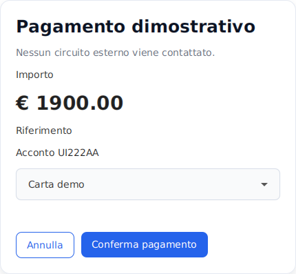
<p class="caption">Figura 5 — P-40 mostra solo importo, riferimento e metodo simulato: nessun dato di carta.</p>
</div>

<div class="figure">
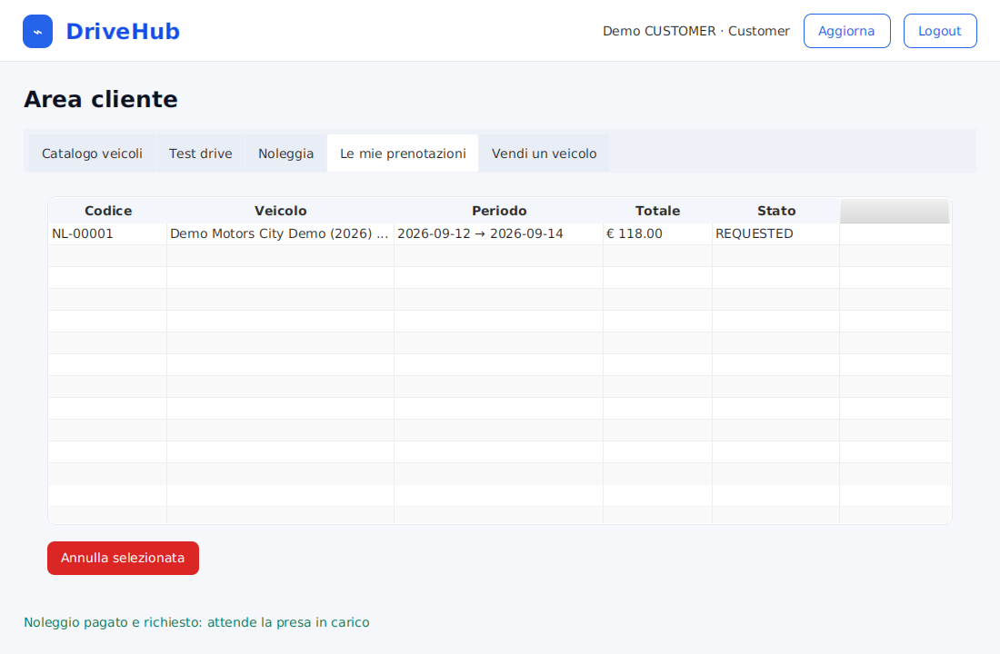
<p class="caption">Figura 6 — Feedback dopo checkout JavaFX→business→PostgreSQL; il Payment è verificato anche dal DAO.</p>
</div>

Gli screenshot sono stati acquisiti da stage JavaFX reali sotto Xvfb, non sono
mockup ridisegnati. Rimane utile una prova umana su desktop fisico per focus,
tastiera, accessibilità e ridimensionamento.

## 6. Architettura e responsabilità

### 6.1 Strati e direzione delle dipendenze

La regola principale è `presentation → business → domain`, con il business che
dipende dalle porte `dao.interfaces` e gli adapter PostgreSQL che le
implementano. Il dominio non conosce JavaFX, JDBC o PostgreSQL; la presentazione
non può accedere direttamente alla persistenza. `DriveHubApplication` è il
composition root: costruisce data source, factory, servizi, gateway e
navigazione.

<div class="figure">
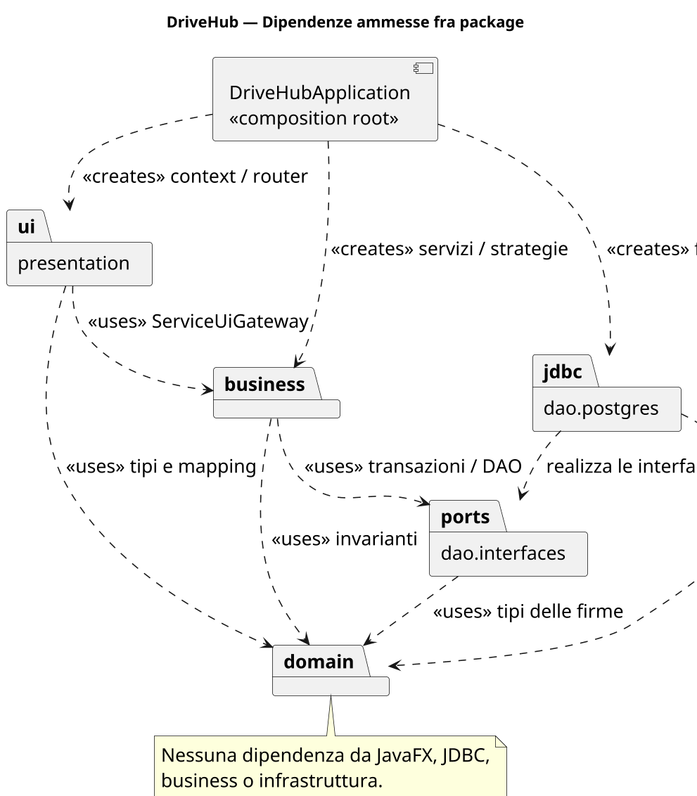
<p class="caption">Figura 7 — Dipendenze ammesse. Le frecce verso le porte consentono di sostituire PostgreSQL nei test.</p>
</div>

| Package | Responsabilità | Dipendenze vietate |
|---|---|---|
| `domain.users/vehicles/rentals/sales/observer` | identità, invarianti, stati ed eventi | JavaFX, JDBC, servizi |
| `business.services` | autorizzazione, casi d'uso, transazioni e policy | widget e SQL letterale |
| `dao.interfaces` | porte, `DaoFactory`, `UnitOfWork` | adapter e presentazione |
| `dao.postgres` | JDBC, mapping, query, migration | decisioni UI/business |
| `presentation.controller/navigation/core` | binding, route, messaggi e proiezioni | DAO e regole persistenti |

Sei test strutturali ispezionano le dipendenze compilate: dominio isolato,
business limitato a dominio/porte, porte indipendenti dagli adapter, adapter
senza business/presentation, UI senza bypass della persistenza e controller
limitati a `UiGateway`/proiezioni.

### 6.2 Servizi e policy

`AuthService`, `CatalogService`, `RentalService`, `TestDriveService`,
`SalesService`, `PurchaseProposalService`, `InventoryService`,
`PricingService`, `DashboardService` e `PaymentService` espongono operazioni
orientate agli use case. `CheckoutService` coordina i flussi economici che
attraversano più aggregati; `UiModelMapper` converte i risultati per la UI senza
decidere prezzi o transazioni.

<div class="figure">
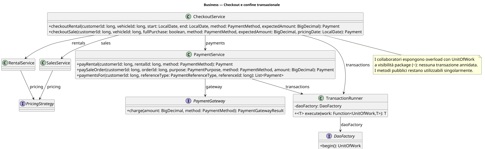
<p class="caption">Figura 8 — Service layer e dipendenze verso factory, gateway e clock.</p>
</div>

<div class="figure">
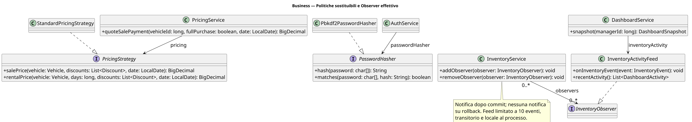
<p class="caption">Figura 9 — Policy sostituibili: pricing, pagamento, transazioni ed eventi di inventario.</p>
</div>

## 7. Progettazione del dominio e dei workflow

### 7.1 Catalogo e identità

`Brand` e `VehicleModel` descrivono il catalogo; `Vehicle` ne rappresenta
l'istanza fisica. Il purpose determina quale prezzo sia obbligatorio. La targa
normalizzata è unica. `User.requireRole` rende esplicita l'autorizzazione di
base, mentre ownership e stato sono controllati dai servizi che conoscono il
caso d'uso.

<div class="figure">
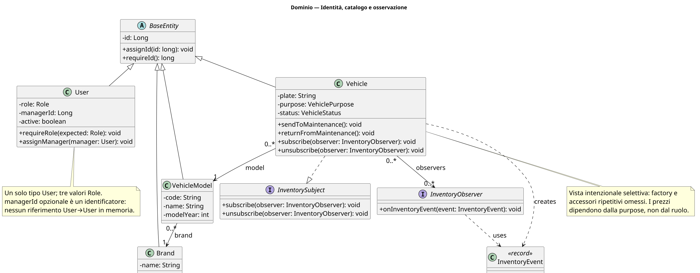
<p class="caption">Figura 10 — Identità, catalogo e relazioni stabili; i riferimenti persistiti non sono composizioni arbitrarie.</p>
</div>

### 7.2 Macchine a stati

| Aggregato | Percorso normale | Uscite alternative |
|---|---|---|
| TestDrive | `REQUESTED→CONFIRMED→IN_PROGRESS→COMPLETED` | `CANCELLED` negli stati ammessi |
| Rental | `REQUESTED→ASSIGNED→CONFIRMED→ACTIVE→COMPLETED` | `CANCELLED` prima degli stati terminali secondo ownership/pagamento |
| SaleOrder | `RESERVED→DEPOSIT_PAID` oppure `RESERVED→PAID→COMPLETED` | `CANCELLED` su failure compatibile |
| Payment | `PENDING→COMPLETED` oppure `PENDING→FAILED` | nessuna seconda transizione terminale |
| PurchaseProposal | `REQUESTED→OFFERED→APPROVED/REJECTED` | decisione singola |
| StockOrder | `PLACED→CONFIRMED→RECEIVED` | cancellazione prima della ricezione se ammessa |

<div class="figure">
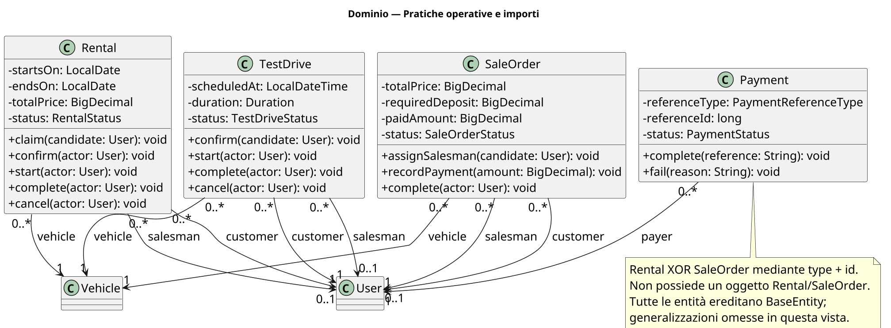
<p class="caption">Figura 11 — Aggregati temporali: attori, intervalli e transizioni protette.</p>
</div>

<div class="figure">
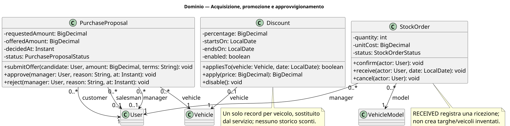
<p class="caption">Figura 12 — Vendita, pagamento, proposta e stock order con stati terminali espliciti.</p>
</div>

La logica di stato è nell'aggregato, non nel controller. Il DAO offre inoltre
update condizionali quando la decisione deve essere atomica rispetto ad altre
sessioni. Questo doppio livello evita sia transizioni illegali nel singolo
oggetto, sia il classico “check-then-act” concorrente.

### 7.3 Presentazione come adattatore

<div class="figure">
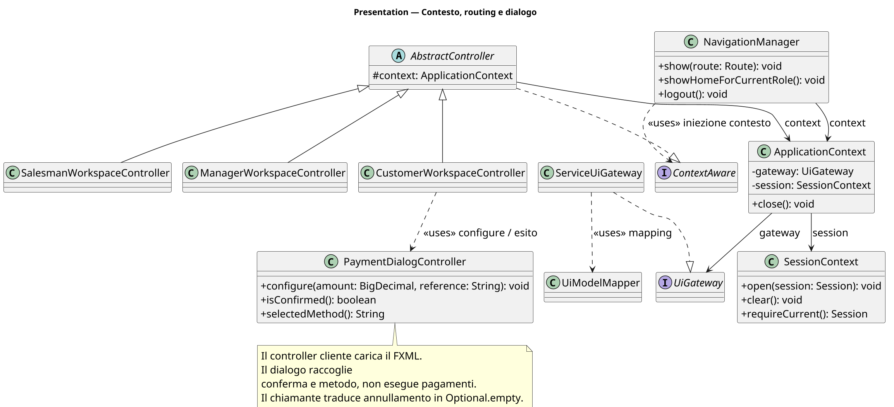
<p class="caption">Figura 13 — Controller, navigazione, sessione e gateway UI. I controller non vedono le porte DAO.</p>
</div>

## 8. Persistenza PostgreSQL

### 8.1 Schema e migration

Cinque migration versionate creano e affinano lo schema. Il bootstrap registra
ogni versione in `drivehub_schema_migrations`, è idempotente e può caricare un
seed dimostrativo privo di dati reali. La prova finale ha avviato uno schema
vuoto su PostgreSQL 16.15 e ha contato 22 foreign key e gli indici previsti.

| Tabella | Identità e riferimenti | Vincoli significativi |
|---|---|---|
| `users` | CF/email, ruolo, `manager_id?` | univocità; ruolo ammesso; supervisore opzionale coerente |
| `brands`, `vehicle_models`, `vehicles` | Brand 1:N Model 1:N Vehicle | nome/codice/targa unici; purpose/prezzo/stato coerenti |
| `discounts` | un veicolo | un record sostituibile; `0 < percentage < 100`; periodo valido |
| `rentals`, `test_drives` | Customer, Salesman?, Vehicle | intervallo valido, stato/assegnazione, protezione overlap |
| `sale_orders` | Customer, Salesman?, Vehicle | deposito, pagato e totale coerenti |
| `payments` | payer e Rental XOR SaleOrder | riferimento esclusivo; purpose/metodo/stato/importo coerenti |
| `purchase_proposals` | Customer, Vehicle, Salesman?, Manager? | dati di offerta/decisione coerenti con lo stato; `decided_at` |
| `stock_orders` | Manager e VehicleModel | quantità/costo positivi; date e stato coerenti |

<div class="figure figure-wide">
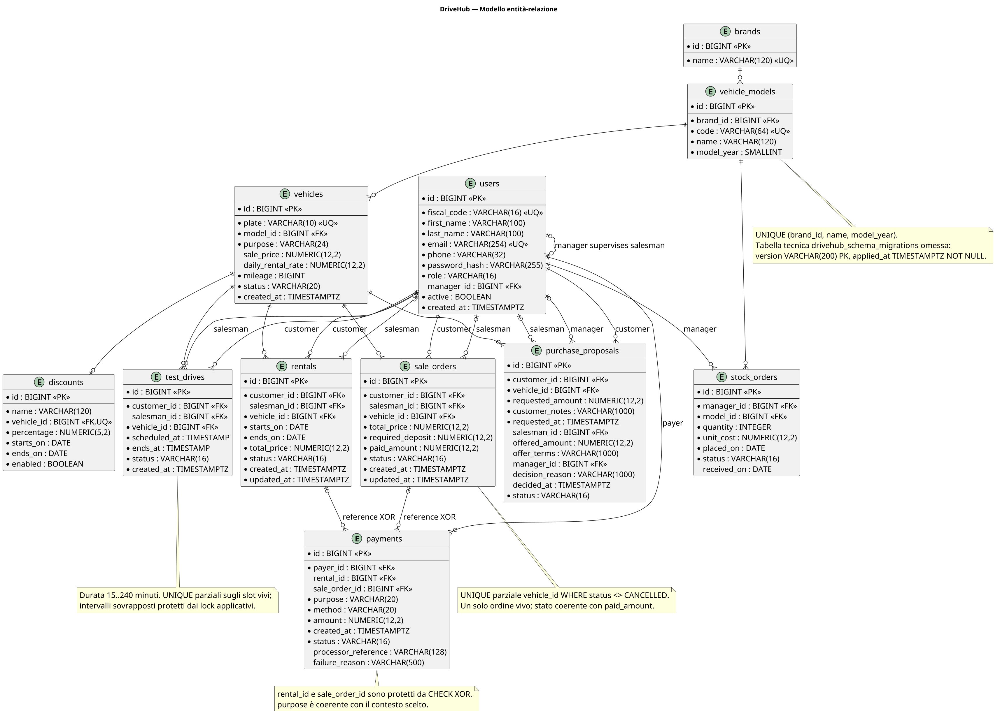
<p class="caption">Figura 14 — ER canonico derivato dalle chiavi effettive e dai vincoli delle cinque migration.</p>
</div>

### 8.2 DAO, mapping e query

Ogni aggregato ha una porta nel package `dao.interfaces`; gli adapter JDBC
incapsulano SQL e ricostruzione. `JdbcEntityLoader` centralizza caricamenti
correlati evitando che ogni DAO replichi il mapping. `UnitOfWork` espone porte
legate alla stessa connessione e possiede commit, rollback e close.

<div class="figure figure-wide">
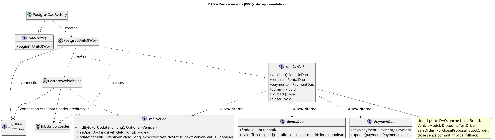
<p class="caption">Figura 15 — Porte di persistenza, factory e adapter PostgreSQL coordinati dalla stessa UnitOfWork.</p>
</div>

Le query critiche non sono semplici CRUD: ricerca catalogo, ownership, slot
half-open, overlap di periodi, righe “for update”, code non assegnate e update
compare-and-set. PostgreSQL aggiunge indici unici parziali per impedire doppie
operazioni attive senza vietare il riuso di record cancellati.

## 9. Scenari dinamici e transazioni

### 9.1 Noleggio e pagamento

<div class="figure sequence">
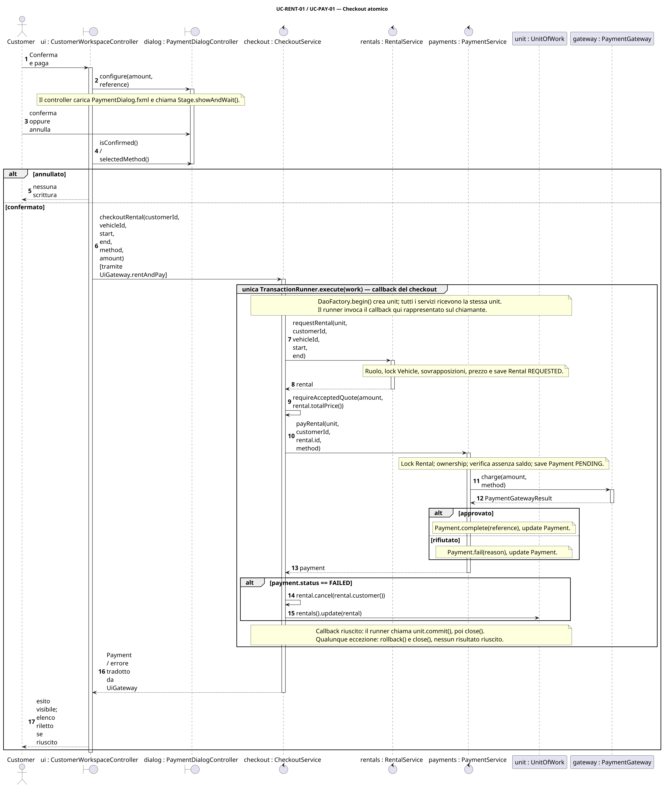
<p class="caption">Figura 16 — Il confine di `TransactionRunner.execute` comprende Rental, Payment ed esito; quote scaduto e rollback sono espliciti.</p>
</div>

Il decline è un esito previsto e viene conservato come audit `FAILED` insieme a
Rental `CANCELLED`. Un'eccezione inattesa, invece, propaga e fa rollback. La
distinzione è importante: “pagamento rifiutato” è informazione di dominio,
mentre una persistenza parziale è un difetto tecnico.

### 9.2 Vendita, acconto e saldo

<div class="figure sequence">
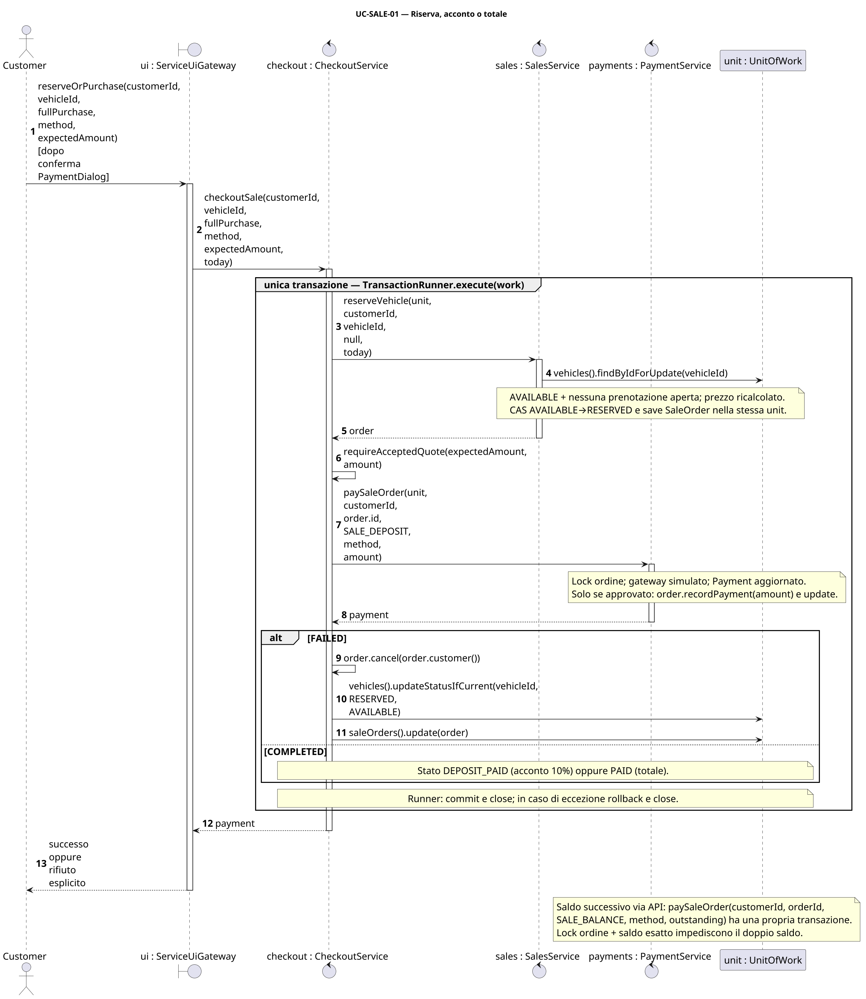
<p class="caption">Figura 17 — Lock del veicolo, scelta del purpose e aggiornamento dell'ordine impediscono doppia vendita e sovrapagamento.</p>
</div>

L'acconto usa `SALE_DEPOSIT` e deve coprire esattamente il deposito residuo;
l'acquisto integrale e il saldo usano `SALE_BALANCE` e devono coprire
esattamente il residuo totale. Una richiesta concorrente trova il veicolo non
più disponibile oppure perde l'update atomico.

### 9.3 Test drive e proposta

<div class="figure sequence">
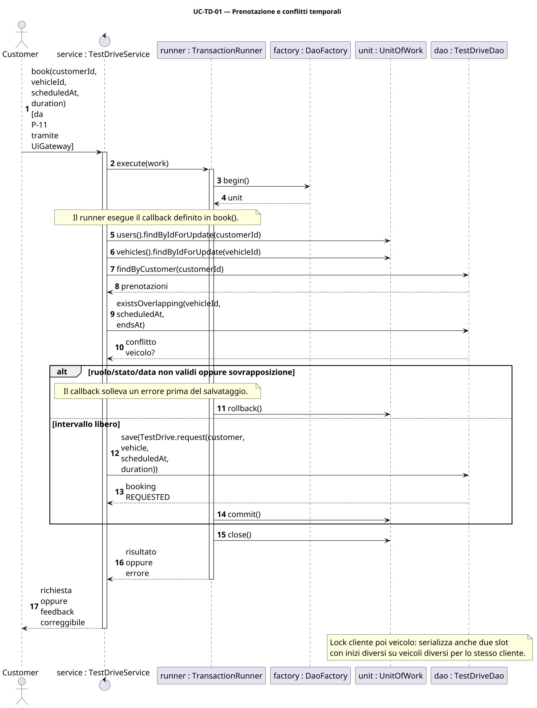
<p class="caption">Figura 18 — Prenotazione, claim esclusivo e lifecycle del test drive.</p>
</div>

<div class="figure sequence">
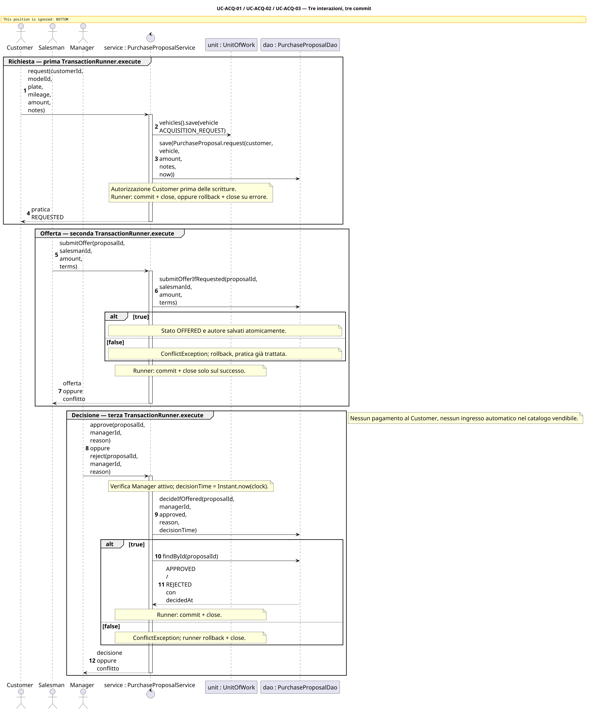
<p class="caption">Figura 19 — Customer, Salesman e Manager cooperano; la decisione terminale usa CAS e registra l'istante.</p>
</div>

I diagrammi di sequenza sono modelli progettuali scritti manualmente e
confrontati con le firme reali; non sono reverse engineering dal codice.

## 10. Implementazione e pattern

### 10.1 Unit of Work e gestione degli errori

`TransactionRunner` rende unico il protocollo: apre, esegue, commit-ta e, su
`RuntimeException` o `Error`, prova il rollback senza nascondere la causa
originale. Il try-with-resources garantisce la chiusura.

```java
public <T> T execute(Function<UnitOfWork, T> work) {
    try (UnitOfWork unit = daoFactory.begin()) {
        try {
            T result = work.apply(unit);
            unit.commit();
            return result;
        } catch (RuntimeException | Error failure) {
            try { unit.rollback(); }
            catch (RuntimeException rollbackFailure) {
                failure.addSuppressed(rollbackFailure);
            }
            throw failure;
        }
    }
}
```

Problema risolto: evitare commit/rollback duplicati nei servizi e preservare
l'errore diagnostico. Partecipanti: servizio, `TransactionRunner`,
`DaoFactory`, `UnitOfWork`. Il test `UT-TX-01` controlla anche il raro caso in
cui il commit fallisce e il rollback produce un secondo errore.

### 10.2 Checkout atomico e preventivo autorevole

Il controller non crea prima la pratica e poi paga in una transazione diversa.
`CheckoutService` racchiude l'intero caso d'uso e rifiuta un preventivo obsoleto
prima di chiamare il gateway.

```java
return transactions.execute(unit -> {
    Rental rental = rentals.request(unit, customerId, vehicleId,
            startDate, endDate);
    requireAcceptedQuote(expectedAmount, rental.totalPrice());
    Payment payment = payments.payRental(unit, customerId,
            rental.requireId(), method);
    if (payment.status() == PaymentStatus.FAILED) {
        rental.cancel(rental.customer());
        unit.rentals().update(rental);
    }
    return payment;
});
```

Per la vendita lo stesso coordinatore sceglie esplicitamente il purpose:

```java
PaymentPurpose purpose = fullPurchase
        ? PaymentPurpose.SALE_BALANCE
        : PaymentPurpose.SALE_DEPOSIT;
Payment payment = payments.paySaleOrder(unit, customerId,
        order.requireId(), purpose, method, amount);
```

Questo è Service Layer applicato a un obiettivo utente, non una mera collezione
di metodi CRUD. Il vantaggio è osservabile nei test di decline, quote scaduto,
errore gateway e doppia vendita.

### 10.3 Lock, residuo e purpose del pagamento

`PaymentService` carica l'ordine con lock, verifica proprietario, stato e
residuo e accetta solo l'importo esatto richiesto:

```java
SaleOrder order = unit.saleOrders().findByIdForUpdate(orderId)
        .orElseThrow(() -> new EntityNotFoundException("sale order", orderId));
requireOwner(customer, order.customer());
validateSalePayment(order, purpose, amount);
// ... salva PENDING, invoca il gateway, salva l'esito ...
if (payment.status() == PaymentStatus.COMPLETED) {
    order.recordPayment(amount);
    unit.saleOrders().update(order);
}
```

L'acconto in eccesso non viene reinterpretato come saldo; il saldo parziale non
è accettato; un ordine già coperto non produce un secondo Payment. Questa scelta
riduce ambiguità e rende l'oracolo ripetibile.

### 10.4 Observer dopo il commit

`Vehicle` emette un `InventoryEvent`, ma `InventoryService` lo raccoglie durante
la transazione e lo pubblica agli observer esterni solo dopo il commit:

```java
Vehicle changed = transactions.execute(unit -> {
    Vehicle vehicle = unit.vehicles().findByIdForUpdate(vehicleId).orElseThrow();
    InventoryObserver collector = committedEvents::add;
    vehicle.subscribe(collector);
    try { vehicle.sendToMaintenance(); }
    finally { vehicle.unsubscribe(collector); }
    unit.vehicles().update(vehicle);
    return vehicle;
});
committedEvents.forEach(this::notifyObservers);
```

Problema: una notifica pre-commit potrebbe mostrare in dashboard uno stato poi
annullato. Partecipanti: `Vehicle` subject, `InventoryObserver`,
`InventoryService` e `InventoryActivityFeed`. La collaborazione after-commit è
provata da test di commit, rollback e unsubscribe. Un errore di un observer
secondario è loggato dopo il commit e non rende fittizio un rollback.

### 10.5 Strategy, DAO, Gateway e Composition Root

- **Strategy**: `StandardPricingStrategy` sceglie lo sconto applicabile più
  alto e non cumula candidati. `PricingService` la usa e mantiene un record
  sostituibile; il vantaggio è poter variare la policy senza modificare gli
  aggregati o i controller.
- **DAO + Unit of Work**: le porte definiscono il linguaggio di persistenza; gli
  adapter PostgreSQL implementano query, lock e CAS. I servizi sono testabili
  con implementazioni in memoria o mock.
- **Gateway**: `PaymentGateway` separa il workflow dal processore simulato. Non
  raccoglie carta o credenziali. Un gateway reale richiederebbe chiavi di
  idempotenza, outbox/riconciliazione e gestione di esiti asincroni.
- **Composition Root**: `DriveHubApplication` è l'unico punto che collega
  configurazione, PostgreSQL, servizi, gateway UI, sessione e navigazione; ciò
  evita service locator nascosti nei controller.
- **Mapper**: `UiModelMapper` converte dominio in record di presentazione. È una
  responsabilità di adattamento, non viene presentato come pattern GoF.

I pattern sono inclusi perché risolvono problemi effettivi e hanno test
osservabili; non si attribuiscono nomi decorativi a semplici classi.

### 10.6 Configurazione e avvio

`pom.xml` fissa release 21, JavaFX 21, JUnit 5, Mockito 5.20 con javaagent e
JaCoCo 0.8.14. Le credenziali DB provengono dalle variabili documentate in
`.env.example`; `.env` non è versionato. `compose.yaml` avvia PostgreSQL 16. La
procedura locale è:

```bash
docker compose up -d
mvn javafx:run
```

Lo script `scripts/test_full_stack.sh` usa invece credenziali casuali effimere,
una rete isolata e rimuove le risorse al termine.

## 11. Strategia ed esiti dei test

### 11.1 Metodo

La suite combina prospettive diverse:

| Livello | Tecnica | Esempi di oracolo |
|---|---|---|
| dominio/servizi | white-box unit | ramo, eccezione, transizione, chiamata/assenza di chiamata |
| funzionale | black-box via API business | obiettivo attore, stato finale e scritture visibili |
| DAO/schema | gray-box integration | round-trip, SQLSTATE, query, lock, CAS, rollback |
| architettura/FXML | strutturale/contratto | dipendenze vietate, handler e risorse |
| JavaFX | smoke end-to-end | stage, route, dialog, feedback, doppio click, persistenza reale |

Un test funzionale esprime l'oracolo in termini di esito utente e stato
persistito, senza dipendere dai dettagli JDBC:

```java
Payment payment = checkout.checkoutRental(customer.requireId(),
        rentalVehicle.requireId(), DAY, DAY.plusDays(3),
        PaymentMethod.CARD, RENT_TOTAL);
assertEquals(PaymentStatus.COMPLETED, payment.status());
assertEquals(RentalStatus.REQUESTED,
        rental(payment.referenceId()).status());
assertEquals(RENT_TOTAL, payment.amount());
```

Un integration test concorrente usa invece due richieste reali e un oracolo
gray-box sul numero delle righe:

```java
oneWinner(
    () -> checkout.checkoutSale(customer.requireId(), sale.requireId(),
            true, PaymentMethod.CARD, price, DAY),
    () -> checkout.checkoutSale(other.requireId(), sale.requireId(),
            true, PaymentMethod.CARD, price, DAY));
assertEquals(1, charges.get());
assertEquals(1, count("sale_orders"));
assertEquals(1, count("payments"));
```

H2 in modalità PostgreSQL accelera la suite standard ma non è contato come
prova del DB target. Il profilo PostgreSQL avvia il server reale e verifica
constraint, mapping e concorrenza con connessioni indipendenti.

### 11.2 Risultati riproducibili

| Ambiente/comando | Test | Failure / error / skipped | Esito |
|---|---:|---:|---|
| host OpenJDK 25.0.4.1, target bytecode 21, `mvn clean test` | 81 | 0 / 0 / 0 | `BUILD SUCCESS` |
| Temurin 21.0.9, suite standard | 81 | 0 / 0 / 0 | `BUILD SUCCESS` |
| Temurin 21 + PostgreSQL 16.15 | 101 | 0 / 0 / 0 | `BUILD SUCCESS` |
| Temurin 21 + Xvfb/GTK, 7 smoke JavaFX | 88 | 0 / 0 / 0 | `BUILD SUCCESS` |
| full stack Temurin 21 + PostgreSQL 16.15 + 8 smoke JavaFX | **109** | **0 / 0 / 0** | **`BUILD SUCCESS`, 29,062 s Maven** |

Il test JavaFX aggiuntivo del profilo full-stack attraversa il composition root,
effettua login dei tre ruoli, carica il catalogo dal DB, conferma un noleggio e
ricontrolla tramite DAO un Rental e un Payment `COMPLETED` dello stesso importo.

Le prove PostgreSQL hanno verificato cinque migration da schema vuoto, seed
idempotente, 22 foreign key, undici enum Java contro i CHECK effettivi,
UNIQUE/CHECK/XOR, query di overlap, indici unici parziali, rollback e otto
scenari concorrenti. Nei casi di vendita, saldo, pagamento noleggio, booking,
claim e decisione viene verificato esattamente il numero di vincitori.

### 11.3 Coverage

| Metrica JaCoCo full-stack | Coperti / totale | Percentuale |
|---|---:|---:|
| istruzioni | 12.604 / 16.083 | 78,37% |
| branch | 687 / 1.095 | 62,74% |
| linee | 2.532 / 3.135 | 80,77% |
| complessità | 1.019 / 1.579 | 64,53% |
| metodi | 825 / 1.025 | 80,49% |
| classi | 94 / 100 | 94,00% |

Non è stata inventata una soglia richiesta dal corso. La coverage non misura la
correttezza dell'oracolo né l'assenza di difetti; è stata privilegiata la
copertura di invarianti, alternative, autorizzazioni, transazioni e race
condition invece di getter e codice dichiarativo.

### 11.4 Riproducibilità ed evidenze

`docs/evidence/full-stack/` contiene log Maven sanitizzato, venti XML Surefire,
`jacoco.xml`, riepilogo versioni/contatori e manifest dei sorgenti. Il commit
base è `ed03c32`; poiché la consegna contiene modifiche non ancora committate,
il manifest SHA-256 completo
`e7fb29af5332d2abf13939c12de0462b99c58573cc722cfceb78dba911aeec25`
identifica la baseline eseguita. Qualunque variazione a sorgenti, SQL, FXML,
POM o Compose richiede una nuova esecuzione.

Comandi:

```bash
mvn clean test
bash scripts/test_postgres.sh
bash scripts/test_full_stack.sh
PLANTUML_JAR=/percorso/plantuml.jar bash scripts/render_diagrams.sh
python3 scripts/build_report.py
```

## 12. Uso dell'intelligenza artificiale

Un assistente AI è stato usato per inventario e confronto delle fonti,
individuazione delle incoerenze, supporto a requisiti/design, revisione di
codice e test, redazione dei PlantUML manuali e composizione della relazione.
Gli originali sono rimasti in sola lettura e ChargeNet è stato usato come
benchmark, non come sorgente di regole o codice del dominio.

Il supporto generativo non costituisce validazione accademica. Per ridurre il
rischio di API, cardinalità o risultati inventati, i nomi sono stati confrontati
con i sorgenti, enum e constraint con PostgreSQL, risultati con XML/log e
diagrammi con rendering e review visiva. Agli autori restano comprensione,
originalità, responsabilità della consegna e capacità di motivare ogni scelta.

Registro sintetico:

| Periodo | Strumento | Attività | Controllo |
|---|---|---|---|
| 23 agosto 2026 | Codex/OpenAI, GPT-5 | analisi iniziale e documentazione | baseline riesaminata; nessuna approvazione attribuita all'AI |
| 7–11 settembre 2026 | Codex/OpenAI, agente di coding | audit, correzioni, test, UML, tracciabilità e report | 109 test, PostgreSQL reale, JavaFX, rendering UML, evidenze versionate |

## 13. Assunzioni, limiti e decisioni aperte

### 13.1 Assunzioni progettuali dichiarate

| ID | Assunzione | Conseguenza/reversibilità |
|---|---|---|
| A-05 | scelta pubblica del ruolo ammessa solo nel prototipo | in produzione serve provisioning amministrativo |
| A-07 | un record sconto sostituibile; Strategy pronta a più candidati | rimuovere la unique abilita storico senza cambiare la policy |
| A-08 | un noleggio operativo è modificato dal Salesman assegnatario | algoritmo di assegnazione sostituibile, policy da confermare |
| A-09 | giorni civili con estremo finale esclusivo | convenzione da mostrare chiaramente in UI |
| A-10 | SaleOrder rappresenta riserva/acquisto con deposito e saldo | rimborso/scadenza richiedono nuove regole |
| A-13 | gateway simulato locale, senza side effect esterni | un provider reale richiede idempotenza e riconciliazione |

### 13.2 Decisioni che non devono essere inventate

Prima di trasformare il prototipo in prodotto servono indicazioni su:

- provisioning degli account staff e supervisione Manager–Salesman;
- algoritmo di assegnazione dei noleggi;
- percentuale/deadline dell'acconto, rimborso e scadenza della riserva;
- durata degli slot, orari di apertura e fuso operativo;
- consegna/rientro fisico, danni, aspetti fiscali e conservazione documentale;
- fornitori, pagamento reale e target di deploy.

Queste decisioni non bloccano la coerenza tecnica della baseline perché le
funzioni non specificate sono fuori scope o isolate dietro policy/porte.

### 13.3 Limiti della verifica

- i 17 PlantUML sono sintatticamente validi e confrontati con i sorgenti, ma il
  rendering non dimostra da solo la correttezza semantica del modello;
- PostgreSQL 16.15 è stato provato in modo funzionale e concorrente, non con un
  carico di lunga durata;
- gli otto smoke JavaFX istanziano stage reali sotto Xvfb, ma non sostituiscono
  una valutazione umana di accessibilità, focus e monitor diversi;
- il gateway non dimostra integrazione finanziaria, deliberatamente fuori scope;
- nomi e matricole devono essere inseriti dagli autori prima della consegna.

## 14. Conclusioni e guida alla discussione

DriveHub realizza i tre percorsi di ruolo con una separazione verificata fra UI,
servizi, dominio e persistenza. I rischi principali — pagamento atomico,
preventivo obsoleto, doppia vendita, doppio saldo, overlap e decisione
concorrente — sono resi espliciti nel design e possiedono test con oracolo sullo
stato persistito. La documentazione usa gli stessi ID di requisiti, use case,
pagine e test; diagrammi e screenshot fanno parte del prodotto verificato.

Checklist per la presentazione:

1. compilare autore/i e matricola/e e rigenerare il PDF;
2. spiegare il confine `CheckoutService`/`UnitOfWork` e la differenza fra decline
   previsto ed eccezione inattesa;
3. mostrare perché lock, CAS e indici parziali servono insieme;
4. motivare Strategy e Observer attraverso i rispettivi test, non solo tramite
   il nome del pattern;
5. distinguere test unitari, funzionali, DAO PostgreSQL e smoke JavaFX;
6. dichiarare A-05/A-08 e i limiti del gateway senza attribuire scelte al docente;
7. rieseguire lo script full-stack dopo ogni modifica della baseline.

Il criterio tecnico di uscita è soddisfatto dalla prova full-stack da 109 test,
0 failure, 0 error e 0 skipped. La consegna resta “release candidate” finché gli
autori non compilano i dati personali ed eseguono la checklist manuale sul
desktop usato per la discussione.
